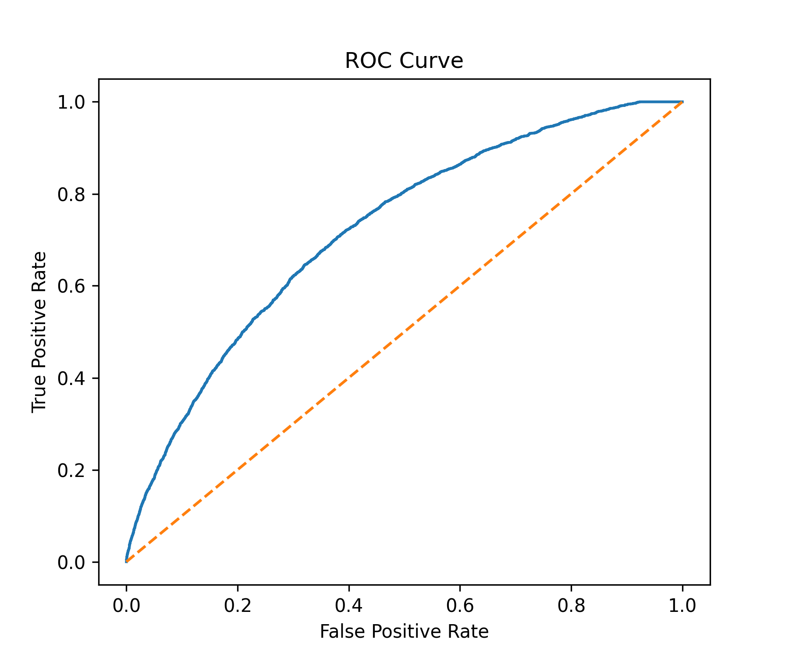
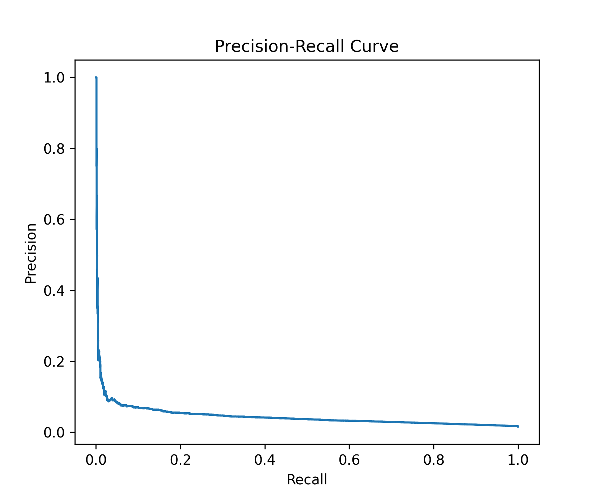
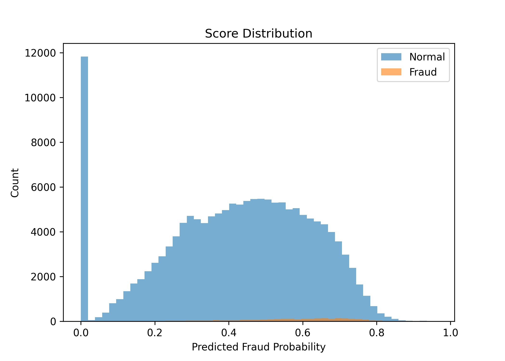
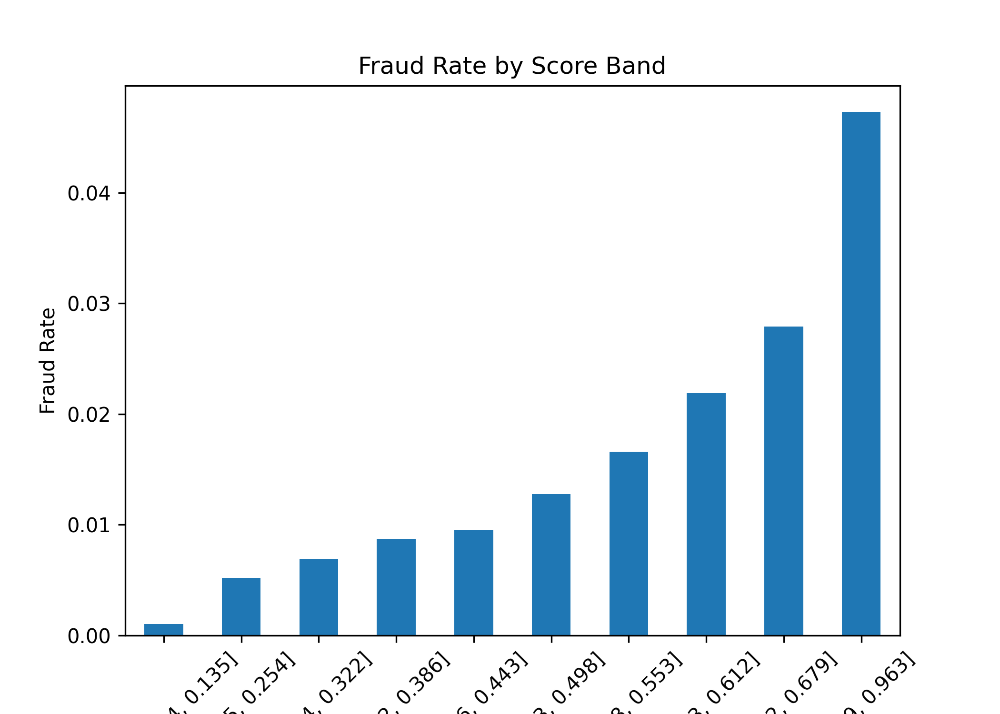

# Credit Card Fraud Risk Modeling

This project builds a credit card fraud detection model using transaction-level data.  
The goal is to estimate the probability of fraud for each transaction and support automated risk decisions such as **approve, review, or decline**.

The workflow follows a typical fraud risk modeling pipeline used in financial institutions:

EDA → Feature Engineering → Model Training → Risk Scoring → Decision Policy

---

# Dataset

The dataset contains approximately **780,000 transactions** with a fraud rate of about **1.6%**, making this a highly imbalanced classification problem.

The dataset includes the following variables:

- `accountNumber`: a unique identifier for the customer account associated with the transaction
- `customerId`: a unique identifier for the customer associated with the transaction
- `creditLimit`: the maximum amount of credit available to the customer on their account
- `availableMoney`: the amount of credit available to the customer at the time of the transaction
- `transactionDateTime`: the date and time of the transaction
- `transactionAmount`: the amount of the transaction
- `merchantName`: the name of the merchant where the transaction took place
- `acqCountry`: the country where the acquiring bank is located
- `merchantCountryCode`: the country where the merchant is located
- `posEntryMode`: the method used by the customer to enter their payment card information during the transaction
- `posConditionCode`: the condition of the point-of-sale terminal at the time of the transaction
- `merchantCategoryCode`: the category of the merchant where the transaction took place
- `currentExpDate`: the expiration date of the customer's payment card
- `accountOpenDate`: the date the customer's account was opened
- `dateOfLastAddressChange`: the date the customer's address was last updated
- `cardCVV`: the three-digit CVV code on the back of the customer's payment card
- `enteredCVV`: the CVV code entered by the customer during the transaction
- `cardLast4Digits`: the last four digits of the customer's payment card
- `transactionType`: the type of transaction
- `echoBuffer`: an internal variable used by the financial institution
- `currentBalance`: the current balance on the customer's account
- `merchantCity`: the city where the merchant is located
- `merchantState`: the state where the merchant is located
- `merchantZip`: the ZIP code where the merchant is located
- `cardPresent`: whether or not the customer's payment card was present at the time of the transaction
- `posOnPremises`: whether or not the transaction took place on the merchant's premises
- `recurringAuthInd`: whether or not the transaction was a recurring payment
- `expirationDateKeyInMatch`: whether or not the expiration date of the payment card was entered correctly during the transaction
- `isFraud`: whether or not the transaction was fraudulent

The target variable:

`isFraud`

---

# Exploratory Data Analysis

Exploratory analysis was conducted to understand transaction behavior and identify potential fraud signals.

Key observations:

- Fraud transactions tend to have higher transaction amounts
- CVV mismatch is associated with elevated fraud probability
- Certain merchant categories show higher fraud exposure
- High transaction frequency for the same card may indicate suspicious activity

---

**Categorical encoding**

One-hot encoding was applied to variables such as:

- merchantCategoryCode
- transactionType
- country information

---

# Model

A **Logistic Regression model** was trained using a preprocessing pipeline including feature scaling and categorical encoding.

The model outputs a **fraud probability score** for each transaction.

---

# Model Performance

| Metric | Value |
|------|------|
| ROC-AUC | 0.72 |
| PR-AUC | 0.045 |
| KS | 0.33 |
| PSI | 0.00005 |

These metrics indicate reasonable separation between fraudulent and legitimate transactions.

---

# Risk Decision Policy

Transactions are categorized into three risk tiers based on predicted fraud probability.

| Score Range | Decision |
|-------------|----------|
| score ≥ 0.91 | DECLINE |
| 0.60 ≤ score < 0.91 | REVIEW |
| score < 0.60 | APPROVE |

This structure mimics a typical **risk control workflow in fraud prevention systems**.

---

# Risk Tier Summary

| Decision | Transactions | Fraud Rate |
|--------|--------|--------|
| DECLINE | 40 | 30% |
| REVIEW | 34547 | 3.6% |
| APPROVE | 122686 | 1.0% |

The decline tier successfully concentrates the highest-risk transactions.

---

# Model Visualization

### ROC Curve

---

### Precision–Recall Curve

---

### Score Distribution

---

### Fraud Rate by Score Band

Fraud rates increase monotonically across score bands, indicating that the model provides meaningful risk ranking.

---

# Top Risk Drivers

Positive fraud indicators include:

- airline merchants
- rideshare services
- online retail
- fast food merchants
- unknown merchant country

Negative risk indicators include:

- fuel merchants
- subscription services
- mobile app payments

These signals reflect behavioral differences between fraudulent and legitimate transactions.

---

# Output

The model generates a fraud risk score and decision category for each transaction.

Example output:

score_pd, decision

0.93, DECLINE

0.72, REVIEW

0.12, APPROVE